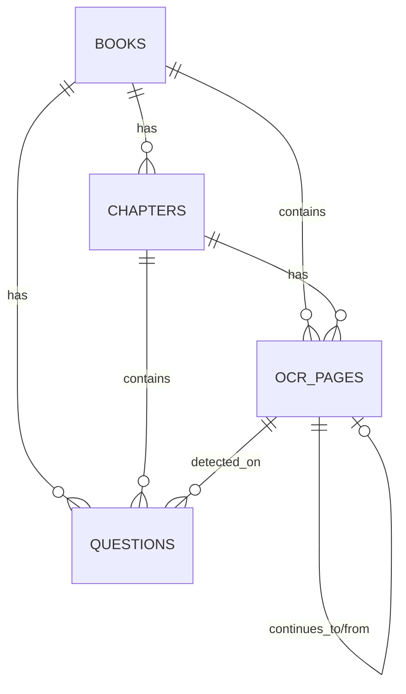

# Digital Library Database Reference

This document provides a complete technical reference for the `digital_library` MongoDB database, including schema definitions, relationships, and realistic JSON data examples.

## 1. Entity Relationships

The system uses four main collections with the following hierarchical relationships:



---

## 2. Collection Details & Examples

### 2.1 Books Collection (`books`)
Stores high-level metadata about a specific textbook.

| Field | Type | Description |
| :--- | :--- | :--- |
| `_id` | ObjectId | Unique identifier |
| `title` | String | Title of the book |
| `subject` | String | Subject area (e.g., "Physics", "Math") |
| `class_name` | String | Target class level |
| `cover_image_url`| String | URL to the cover image on R2 |

**JSON Example:**
```json
{
  "_id": "64f1a2b3c4d5e6f7a8b9c0d1",
  "title": "Higher Secondary Physics First Paper",
  "subject": "Physics",
  "class_name": "Class 11-12",
  "author": "NCTB",
  "total_pages": 450,
  "total_chapters": 10,
  "cover_image_url": "https://pub-your-id.r2.dev/books/64f1a2b3c4d5e6f7a8b9c0d1/cover.png",
  "created_at": "2023-10-01T10:00:00Z",
  "updated_at": "2023-10-01T10:00:00Z"
}
```

---

### 2.2 Chapters Collection (`chapters`)
Segments the book into logical chapters with specific page ranges.

| Field | Type | Description |
| :--- | :--- | :--- |
| `_id` | ObjectId | Unique identifier |
| `book_id` | ObjectId | Reference to parent book |
| `start_page` | Integer | Absolute start page in PDF |
| `end_page` | Integer | Absolute end page in PDF |
| `image_folder_url`| String | Base R2 URL for chapter images |

**JSON Example:**
```json
{
  "_id": "64f1a2b3c4d5e6f7a8b9c0d2",
  "book_id": "64f1a2b3c4d5e6f7a8b9c0d1",
  "chapter_num": 1,
  "title": "Physical World and Measurement",
  "start_page": 1,
  "end_page": 35,
  "total_pages": 35,
  "image_folder_url": "https://pub-your-id.r2.dev/books/64f1a2b3c4d5e6f7a8b9c0d1/chapters/ch_01/",
  "ocr_status": "verified",
  "created_at": "2023-10-01T10:05:00Z"
}
```

---

### 2.3 OCR Pages Collection (`ocr_pages`)
Represents a single page image and its OCR state.

| Field | Type | Description |
| :--- | :--- | :--- |
| `_id` | ObjectId | Unique identifier |
| `image_url` | String | Direct R2 URL to page image |
| `ocr_status` | Enum | `pending`, `processing`, `completed`, `verified` |
| `raw_ocr_json` | Object | Output from Gemini LLM |
| `verified_json` | Object | Human-corrected data |
| `version` | Integer | **Optimistic Locking** version |

**JSON Example:**
```json
{
  "_id": "64f1a2b3c4d5e6f7a8b9c0d3",
  "book_id": "64f1a2b3c4d5e6f7a8b9c0d1",
  "chapter_id": "64f1a2b3c4d5e6f7a8b9c0d2",
  "page_number": 12,
  "image_url": "https://pub-your-id.r2.dev/books/64f1a2b3c4d5e6f7a8b9c0d1/chapters/ch_01/page_012.png",
  "ocr_status": "verified",
  "raw_ocr_json": { ... }, 
  "verified_json": { ... },
  "continues_from_page": null,
  "continues_to_page": "64f1a2b3c4d5e6f7a8b9c0d4",
  "version": 2,
  "created_at": "2023-10-01T10:10:00Z",
  "updated_at": "2023-10-01T10:15:00Z"
}
```

---

### 2.4 Questions Collection (`questions`)
Stores individual questions extracted from pages.

| Field | Type | Description |
| :--- | :--- | :--- |
| `_id` | ObjectId | Unique identifier |
| `book_id` | ObjectId | Reference to parent book |
| `chapter_id` | ObjectId | Reference to parent chapter |
| `page_id` | ObjectId | Reference to source page |
| `type` | Enum | `mcq`, `short`, `creative` |
| `question_text` | String | The main question stem |
| `image_url` | String | (Optional) Stimulus image URL |
| `spans_pages` | Array | Pages this question covers |

#### Example: Creative Question (CQ)
```json
{
  "_id": "64f1a2b3c4d5e6f7a8b9c0d5",
  "book_id": "64f1a2b3c4d5e6f7a8b9c0d1",
  "chapter_id": "64f1a2b3c4d5e6f7a8b9c0d2",
  "page_id": "64f1a2b3c4d5e6f7a8b9c0d3",
  "type": "creative",
  "question_text": "চিত্রটি লক্ষ কর এবং নিচের প্রশ্নগুলোর উত্তর দাও: [উদ্দীপক টেক্সট]",
  "has_image": true,
  "image_url": "https://pub-your-id.r2.dev/uploads/2023-10-01/stimulus_123.png",
  "image_description": "A vector diagram showing two forces at an angle.",
  "sub_questions": [
    {
      "index": "ka",
      "text": "ভেক্টর কী?",
      "mark": 1,
      "answer": "যে সকল ভৌত রাশিকে লিখে প্রকাশ করার জন্য মান ও দিক উভয়ের প্রয়োজন হয় তাকে ভেক্টর রাশি বলে।"
    },
    {
      "index": "kha",
      "text": "সামান্তরিকের সূত্রটি বুঝিয়ে লেখ।",
      "mark": 2,
      "answer": "সামান্তরিকের সূত্র অনুযায়ী...",
      "answer_image_url": "https://pub-your-id.r2.dev/uploads/2023-10-01/ans_kha_123.png"
    }
  ],
  "metadata": {
    "board": "Dhaka Board",
    "question_number": "১"
  }
}
```

#### Example: Multiple Choice (MCQ)
```json
{
  "_id": "64f1a2b3c4d5e6f7a8b9c0d6",
  "book_id": "64f1a2b3c4d5e6f7a8b9c0d1",
  "chapter_id": "64f1a2b3c4d5e6f7a8b9c0d2",
  "page_id": "64f1a2b3c4d5e6f7a8b9c0d3",
  "type": "mcq",
  "question_text": "niচের কোনটি স্কেলার রাশি?",
  "options": {
    "ka": "বল",
    "kha": "বেগ",
    "ga": "কাজ",
    "gha": "ত্বরণ"
  },
  "correct_answer": "ga"
}
```

#### Example: Short Question
```json
{
  "_id": "64f1a2b3c4d5e6f7a8b9c0d7",
  "book_id": "64f1a2b3c4d5e6f7a8b9c0d1",
  "chapter_id": "64f1a2b3c4d5e6f7a8b9c0d2",
  "page_id": "64f1a2b3c4d5e6f7a8b9c0d3",
  "type": "short",
  "question_text": "মাত্রা বিশ্লেষণের উপযোগিতা কী?",
  "answer": "মাত্রা বিশ্লেষণের মাধ্যমে সমীকরণের সঠিকতা যাচাই করা যায়।"
}
```
